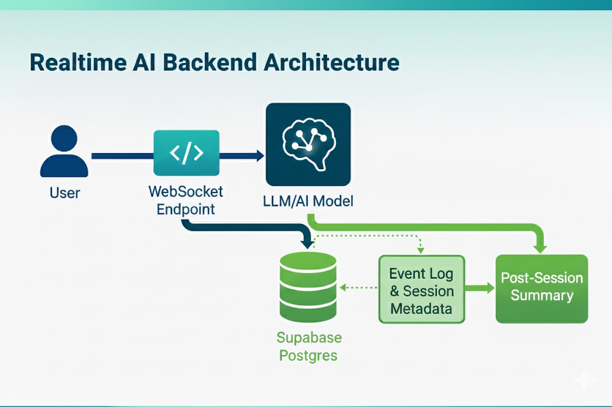

# Realtime AI Backend (WebSockets + Supabase) 🤖💬

## Overview
Realtime AI Backend is an asynchronous Python system built with FastAPI and WebSockets to enable real-time AI conversations. It stores session data in Supabase and automatically generates post-session summaries, demonstrating low-latency communication, multi-turn conversation state management, and backend automation. This project serves as a prototype for AI chatbots, customer support assistants, or interactive tutoring systems.

---

## Features ✨
- Real-time messaging with token-by-token AI streaming  
- Complex LLM interactions (function/tool calls, multi-step workflows)  
- Session and event logging in Supabase for persistence  
- Automatic post-session summary generation  
- Minimal, interactive frontend for testing  

---

## Tech Stack 🛠️
- **Backend:** Python, FastAPI  
- **Database:** Supabase (PostgreSQL)  
- **WebSockets:** FastAPI WebSocket API  
- **LLM Integration:** OpenAI API (or any compatible LLM)  
- **Frontend:** HTML + JavaScript  

---

## Project Structure 📂

```

REALTIME-AI-BACKEND/
│
├── realtime_ai_backend/            # Core backend application
│   ├── assets/                     # Images, diagrams, and static files
│   │   └── Architecture.jpg
│   ├── backend/                    # FastAPI server files
│   │   ├── main.py                 # Entry point for FastAPI server
│   │   ├── websocket.py            # WebSocket connection logic
│   │   ├── llm.py                  # LLM interaction & streaming logic
│   │   ├── db.py                   # Supabase/Postgres connection & queries
│   │   └── post_session.py         # Post-session processing & summary generation
│   └── frontend/                   # Minimal frontend interface
│       └── index.html              # HTML + JS interface for testing
│
├── requirements.txt                # Python dependencies
└── README.md                       # Project documentation

````

---

## Architecture 🏗️
The system consists of four main components: a **frontend client**, a **FastAPI WebSocket server**, an **LLM interaction layer**, and a **Supabase database**. Users send messages through the WebSocket connection, the server streams AI responses back in real-time, all events are logged asynchronously in Supabase, and a post-session job generates a summary stored in the session record.



---

## Setup ⚙️

### 1. Create a virtual environment
```bash
python -m venv venv
# Linux/Mac
source venv/bin/activate
# Windows
venv\Scripts\activate
````

### 2. Install dependencies

```bash
pip install -r requirements.txt
```

### 3. Add environment variables (.env)

```
SUPABASE_URL=<YOUR_SUPABASE_URL>
SUPABASE_KEY=<YOUR_SUPABASE_KEY>
OPENAI_API_KEY=<YOUR_OPENAI_API_KEY>
```

### 4. Run the backend server

```bash
uvicorn backend.main:app --reload
```

### 5. Open frontend

* Open `frontend/index.html` in your browser 🌐
* Start chatting via WebSocket 💬

---

## Database Schema (Supabase) 🗄️

### Sessions Table

```sql
CREATE TABLE sessions (
    session_id UUID PRIMARY KEY DEFAULT gen_random_uuid(),
    user_id UUID,
    start_time TIMESTAMP DEFAULT now(),
    end_time TIMESTAMP,
    summary TEXT
);
```

### Event Log Table

```sql
CREATE TABLE session_events (
    event_id UUID PRIMARY KEY DEFAULT gen_random_uuid(),
    session_id UUID REFERENCES sessions(session_id),
    event_type TEXT,       -- user_message / ai_response / tool_call
    content TEXT,
    created_at TIMESTAMP DEFAULT now()
);
```

---

## WebSocket Workflow 🔄

1. Client connects:

```
ws://localhost:8000/ws/session/{session_id}
```

2. User sends messages 📨 → AI streams responses ⚡ → all events are saved asynchronously in Supabase 💾
3. On disconnect 🔌 → backend triggers post-session processing 📝 → session summary is stored in database

---

